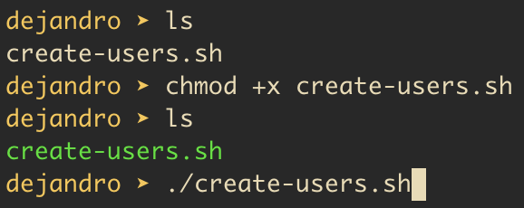

# create-users-locally
Automating the process of user account creation in Linux using the Bash script

1. Make the script executable with the command
   chmod +x create-users.sh
2. Edit the usernames.txt and add usernames
3. Run the script
   ./create-users.sh

   
